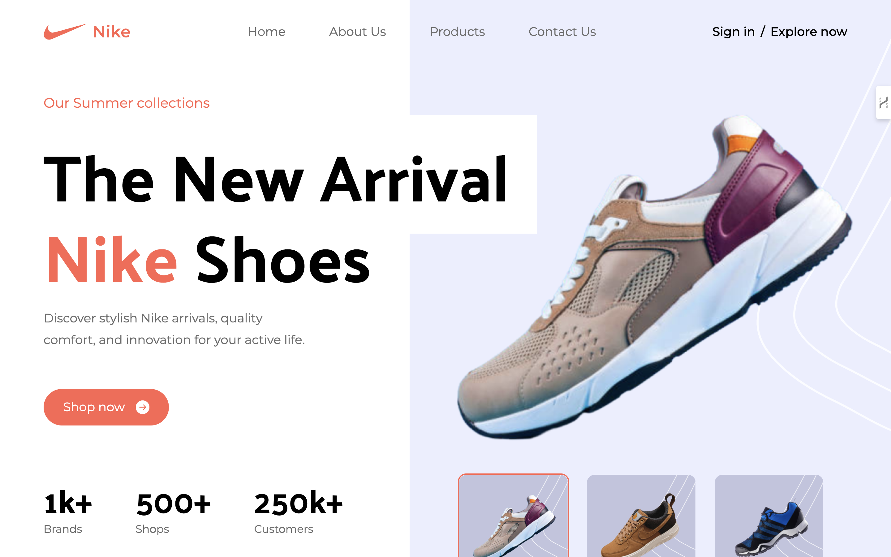
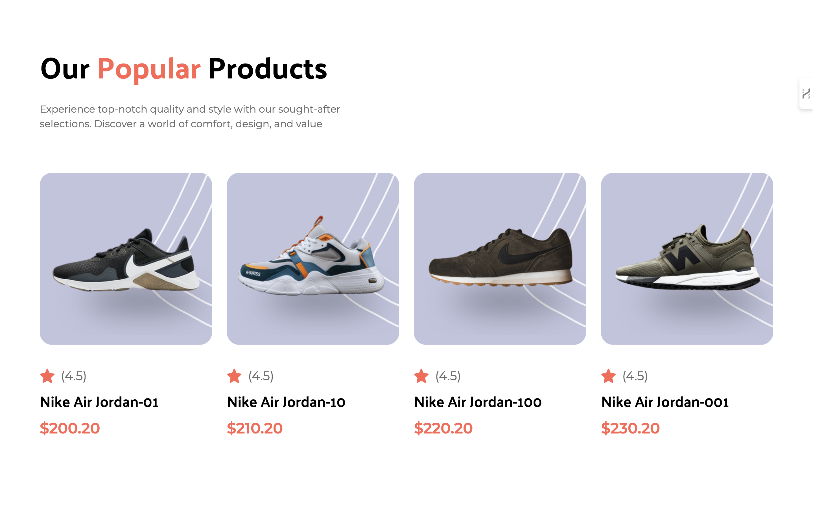

# Nike Website - React & Tailwind CSS

This project is a responsive Nike website clone built using **React.js** and styled with **Tailwind CSS**. The website showcases modern design principles, an intuitive user interface, and a dynamic layout that provides an optimized experience across different screen sizes.


## Screenshots:

### Home Page:



### Product Page:



## Features:
- **Responsive Design:** Ensures seamless performance on mobile, tablet, and desktop devices.
- **React Components:** Modular, reusable components for easier development and maintenance.
- **Tailwind CSS Styling:** Clean and customizable styles powered by utility-first CSS.
- **Dynamic UI:** Interactive sections with smooth animations and transitions.
- **Product Display:** Grid-based product showcase with hover effects.

## Tech Stack:
- **React.js**: Frontend framework for building dynamic user interfaces.
- **Tailwind CSS**: Utility-first CSS framework for fast styling.
- **JavaScript (ES6+):** Modern JavaScript features used throughout the codebase.

## Installation:

   ```bash
   git clone https://github.com/ujjwalxtyagi/nike-website.git
   cd nike-website
   npm install
   npm run dev


   